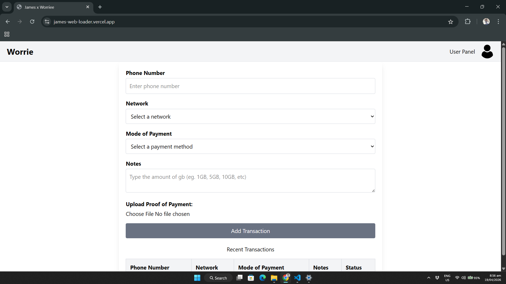

# JMxWorrie — GB Loader App

> One-tap load loading. Zero hassle.



---

## What is JMxWorrie?

A **mobile-first Progressive Web App (PWA)** that makes buying data load as easy as sending a text message. Users submit orders with a receipt, and admins manage everything in **real-time** — no app store download required.

---

## Features at a Glance

| For Users                                 | For Admins                            |
| ----------------------------------------- | ------------------------------------- |
| Simple order form                         | Live dashboard with real-time updates |
| Upload receipt via camera or gallery      | Change order status with one click    |
| Instant status tracking by Transaction ID | Secure admin-only access              |
| Install as PWA on your home screen        | Easy order deletion                   |

---

## How It Works

### User Flow

```
Fill Form  -->  Upload Receipt  -->  Get Transaction ID  -->  Track Status
```

### Admin Flow

```
Login  -->  View Live Orders  -->  Update Status  -->  Done
```

---

## Tech Stack

**Frontend**


**Backend & Infrastructure**


**Security & Auth**


---

## Installation

### Download APK (Recommended for Users)

Download the latest APK directly from the [Releases Tab](https://github.com/worriee/web-loaderbyjimzxworrie/releases).

1. Go to the [Releases page](https://github.com/worriee/web-loaderbyjimzxworrie/releases)
2. Download the latest `.apk` file
3. Open the APK on your Android device
4. Allow installation from unknown sources if prompted
5. Done — the app is ready to use

### Install as PWA (Alternative)

1. Visit the live app URL in your browser
2. Tap **"Add to Home Screen"** when prompted
3. Open from your home screen — it works like a native app

---

## Security

This application implements industry-standard security practices:

- **Bcrypt Password Hashing** — Admin passwords are never stored in plain text
- **JWT httpOnly Cookies** — Session tokens are inaccessible to JavaScript
- **CORS Origin Validation** — Only trusted domains can access the API
- **Rate Limiting** — Brute-force and spam protection via Upstash Redis
- **File Upload Validation** — 5MB size limit, images only (JPG, PNG, WebP)
- **Server-Side Auth Checks** — All admin routes verify JWT before processing

---

## License

MIT License

Built with **James x Worrie**
